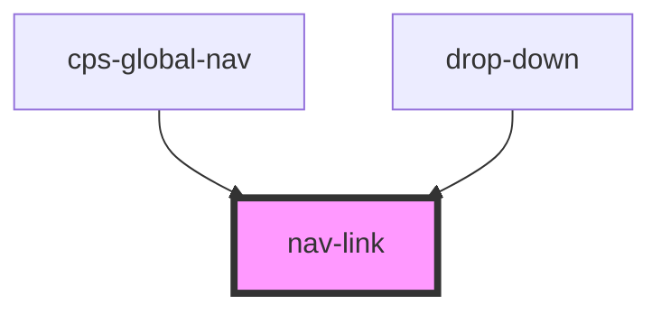

# nav-link

<!-- Auto Generated Below -->

## Properties

| Property       | Attribute         | Description | Type      | Default     |
| -------------- | ----------------- | ----------- | --------- | ----------- |
| `disabled`     | `disabled`        |             | `boolean` | `undefined` |
| `href`         | `href`            |             | `string`  | `undefined` |
| `label`        | `label`           |             | `string`  | `undefined` |
| `openInNewTab` | `open-in-new-tab` |             | `boolean` | `undefined` |
| `selected`     | `selected`        |             | `boolean` | `undefined` |

## Events

| Event                  | Description | Type                  |
| ---------------------- | ----------- | --------------------- |
| `cps-global-nav-event` |             | `CustomEvent<string>` |

## Dependencies

### Used by

 - [cps-global-nav](..)
 - [drop-down](.)

### Graph

----------------------------------------------

*Built with [StencilJS](https://stenciljs.com/)*
