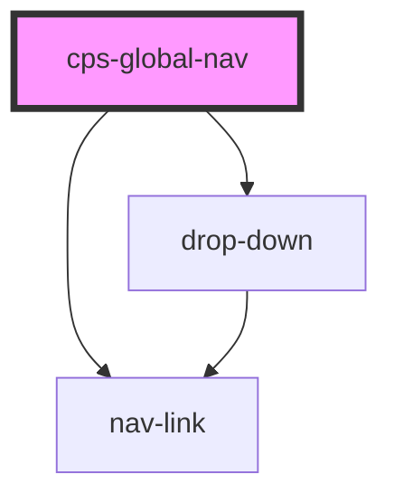

# cps-global-nav

<!-- Auto Generated Below -->

## Properties

| Property | Attribute | Description                                       | Type     | Default            |
| -------- | --------- | ------------------------------------------------- | -------- | ------------------ |
| `name`   | `name`    | The text to appear at the start of the second row | `string` | `"Please wait..."` |

## Dependencies

### Depends on

- [nav-link](internal)
- [drop-down](internal)

### Graph

----------------------------------------------

*Built with [StencilJS](https://stenciljs.com/)*
