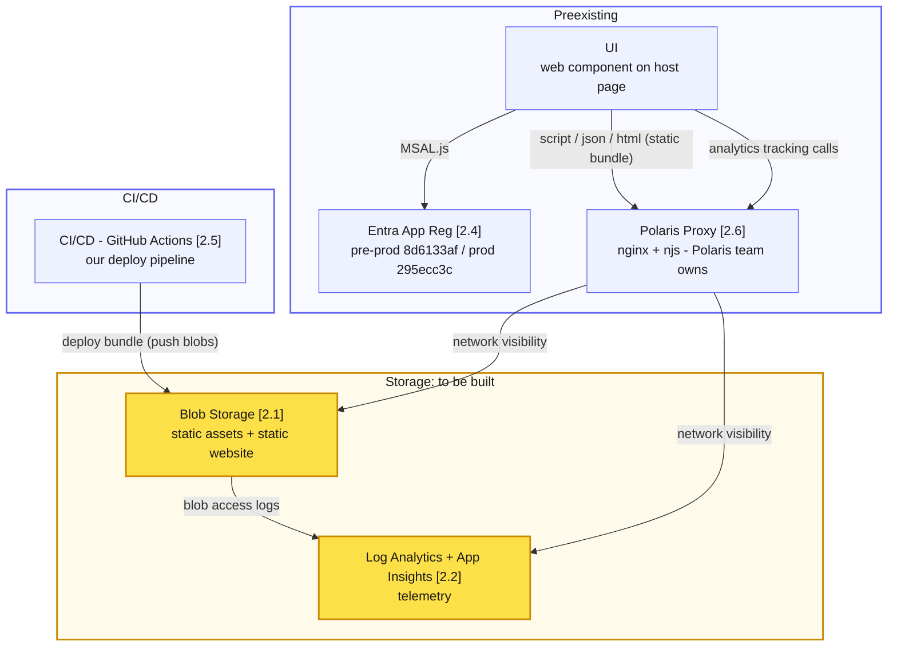

# Global Components — Infrastructure Summary

---

## 1. Summary

### 1.1 TL;DR

Global components has very simple infrastructure requirements:

- Deployable artefacts are created by a github actions-based CI/CD process.
- These artefacts are deployed to, and served from, a blob storage account in Azure. The artefacts are retrieved by browser-based UIs via proxied routes through the Polaris nginx proxy. This means that the Polaris proxy must have network visibility of the blob storage account's endpoints
- Log Analytics is used to collect runtime analytics in two ways:
  - User behaviour tracking calls made from the UI
  - Blob access logs from the storage account are streamed to Log Analytics
- MSAL.js and Entra app registrations allow global components to use OIDC to identify users and obtain JWT identity and access token.

The infrastructure requirements are satisfied by:

- Azure resources created specifically for global components
- Azure resources owned by other areas of the programme (e.g. Polaris proxy)

At the time of writing, the resources owned by global components have been created manually.

This document has two parts:

- **1. Summary** — the fresh set of resources that are to be built and managed by a terraform process.
- **2. Reference** — our existing manually-created infrastructure. The detail here is referenced from the Summary, and numbered so the diagram and provisioning list can point at it (section 2.1, section 2.2, …).

### 1.2 What needs to be provisioned

Build **two parallel stacks — one deployment per tier (pre-prod and prod).** For **each** tier, provision:

- **Blob Storage account** — static-website enabled; serves the component bundle; diagnostic logging → that tier's Log Analytics (section 2.1)
- **Log Analytics workspace + workspace-based App Insights** — telemetry (section 2.2)
- **Network visibility** — private-link / AMPLS so the Polaris proxy can reach both storage and telemetry ingestion (workspace is currently `SecuredByPerimeter`, section 2.2)
- **Blob access logs** → that tier's Log Analytics (section 2.1)
- **CI/CD credential** for GitHub to push blobs — maybe prefer a federated OIDC identity over a storage account key (section 2.5)
- **Region failover resilience** — primary `uksouth`; paired failover region is **UK West (`ukwest`)**.
  - _Blob Storage_: use the **native geo-redundancy** — provision as `Standard_RAGRS` (or `GRS`), **not** today's `Standard_LRS`, giving replication to UK West plus customer-initiated account failover.
  - _Log Analytics_: no simple GRS equivalent — **decision needed**: availability-zone redundancy (in-region only) vs. the newer cross-region **workspace replication** to UK West. DevOps to confirm the approach.

Already in place (**not** in scope for DevOps):

- **Entra app registrations** — pre-prod `8d6133af`, prod `295ecc3c` (section 2.4)
- **Polaris proxy** — owned by the Polaris team; we only author its config slice (section 2.6)

### 1.3 Transition from existing resources to the new resources

The 🟡 highlighted boxes below are the fresh infra to build (× per tier); the rest already exists.

_Bracketed numbers reference the sections below: Blob Storage **[2.1]**, Log Analytics + App Insights **[2.2]**, Entra App Reg **[2.4]**, CI/CD **[2.5]**, Polaris Proxy **[2.6]**._

---

## 2. Reference

### 2.1 Storage account — static asset hosting

**`sacpsglobalcomponents`** (`*.blob.core.windows.net`)

The single most important resource: it serves the component bundle and the accessibility static site, and its access logs are collected by Log Analytics.

| Property                | Terraform concern?   | Value / notes                                                                                                                                 |
| ----------------------- | -------------------- | --------------------------------------------------------------------------------------------------------------------------------------------- |
| Account name            | Yes                  | `sacpsglobalcomponents`                                                                                                                       |
| Subscription / RG       | Yes                  | `<subscription-id>` / `rg-global-nav-dev` (uksouth)                                                                                           |
| Kind / SKU              | Yes                  | `StorageV2` / `Standard_LRS`                                                                                                                  |
| TLS / HTTPS-only        | Yes                  | `TLS1_2` / HTTPS-only enabled                                                                                                                 |
| `allowBlobPublicAccess` | Yes                  | **true** (anonymous access is enabled at the account level)                                                                                   |
| Blob containers (live)  | No — CI-owned        | `dev`, `test`, `uat`, `prod`, `staging`, `unstable`, `prod-safe`, `accessibility`, `analytics`, `case-locking`, `msal-test`, `$web`           |
| Served assets           | No — CI content      | `global-components.js`, `auth-handover.js`, `auth-handover.html`, `statement.html`                                                            |
| Cache-Control on upload | No — CI, upload-time | `max-age=20, stale-while-revalidate=3600, stale-if-error=3600`                                                                                |
| Blob metadata           | No — CI, per-deploy  | `buildsha`, `buildrunid`, `buildtimestamp`, `branch` (stamped per deploy)                                                                     |
| Diagnostic setting      | Yes                  | ✓ `la-global-nav-dev` on `blobServices/default` — `allLogs` + `Transaction` metrics → workspace `la-global-nav-dev` (feeds `StorageBlobLogs`) |

_Terraform concern? — **Yes** = a property/resource Terraform declares; **No** = not managed by Terraform (CI-set content, or a CI-owned resource like the containers)._

> **⚠ The blob containers are created on demand by the GitHub Actions deploy, not pre-provisioned.** `sub-workflow-deploy-script.yml` runs `az storage container create --name <env> --public-access container` (and `sub-workflow-deploy-harnesses.yml` similarly) immediately before uploading, so a container is created the first time an environment is deployed — which is why the account key (not a scoped role)

---

### 2.2 Log Analytics + Application Insights — telemetry

Currently one App Insights instance shared across **all** environments (env is a dimension in the telemetry, not a separate resource). Only the ingestion endpoint differs per env — telemetry is routed through the Polaris proxy rather than sent direct to Azure.

| Property                         | Value / notes                                                                                                                                                                                                                                                                                                        |
| -------------------------------- | -------------------------------------------------------------------------------------------------------------------------------------------------------------------------------------------------------------------------------------------------------------------------------------------------------------------- |
| App Insights Instrumentation Key | `e572c03c-8d38-4771-b193-962f13da1b1a` (identical in dev/test/uat/prod)                                                                                                                                                                                                                                              |
| App Insights Application ID      | `3dafc37d-8c9c-4480-90fc-532ac2b8bba2` (shared)                                                                                                                                                                                                                                                                      |
| Region                           | uksouth (SDK posts to `uksouth-1.in.applicationinsights.azure.com`)                                                                                                                                                                                                                                                  |
| Ingestion endpoint (per env)     | Proxied via `https://{polaris-host}/global-components/analytics/` → proxy `proxy_pass`es to `uksouth-1.in.applicationinsights.azure.com`. Accessibility mode posts **direct**.                                                                                                                                       |
| Log Analytics workspace          | `la-global-nav-dev` · RG `rg-global-nav-dev` · sub `<subscription-id>` · uksouth                                                                                                                                                                                                                                     |
| Workspace GUID (customerId)      | `<workspace-guid>`                                                                                                                                                                                                                                                                                                   |
| Workspace SKU / retention        | `pergb2018` / **30 days**, no daily cap; created 2025-04-29                                                                                                                                                                                                                                                          |
| **Network**                      | ⚠ `publicNetworkAccessForIngestion` **and** `…ForQuery` = **`SecuredByPerimeter`** — the workspace is inside an **Azure Monitor Private Link Scope** (`glob-ampls-uks-vft01`, in sub `<platform-subscription-id>` / RG `uks-rg-vft01`). Ingestion/query are network-restricted; TF must model the AMPLS association. |
| App Insights component           | ✓ `ai-global-nav-dev` (RG `rg-global-nav-dev`, uksouth) — workspace-based; telemetry lands in the `App*` tables (`AppPageViews`/`AppEvents`/`AppExceptions`)                                                                                                                                                         |

---

### 2.3 Analytics content — dashboard, workbook, KQL functions

These live **inside** the Log Analytics workspace / a portal dashboard and are version-controlled in `infra/analytics/`. Deploy/export tooling is in `infra/analytics/scripts/` (runs `az rest` / `az monitor log-analytics` via an SSH bastion — see `AWS_REMOTE` in `.env`).

All live in RG `rg-global-nav-dev` / workspace `la-global-nav-dev`.

| Artifact                  | Resource type                       | Name / GUID                                                   | Source of truth in repo                            |
| ------------------------- | ----------------------------------- | ------------------------------------------------------------- | -------------------------------------------------- |
| Portal dashboard          | `Microsoft.Portal/dashboards`       | `028650ca-6b89-4dc9-a048-70643d7e90de`                        | `infra/analytics/dashboard/dashboard.json`         |
| Workbook                  | `Microsoft.Insights/workbooks`      | `b9e1e051-ca8c-4f5e-9e9f-d6c8acaa1023` (`case-review-totals`) | `infra/analytics/workbook/case-review-totals.json` |
| KQL functions (`GloCo_*`) | LA saved searches (`functionAlias`) | ~30 functions                                                 | `infra/analytics/kql/*.kql` (+ `dependencies.md`)  |

Source tables the functions read: `AppPageViews`, `AppEvents`, `AppExceptions`, `AppDependencies`, `StorageBlobLogs`. Note `GloCo_BlobLogs.kql` hardcodes proxy egress IPs (`10.7.204.126` prod, `10.7.198.126` QA) — infra-coupled values.

---

### 2.4 Entra ID (Azure AD) — app registration

**Two app registrations, split by environment tier** (same tenant). A **pre-prod** registration (`FCT Global Components (dev)`) backs dev/test/uat, and a dedicated **prod** registration (`FCT Global Components (prod)`) backs production.

Values below are **confirmed from the live registrations** (`az ad app show`, 2026-07).

| Property                | Pre-prod (dev/test/uat)                                                                                                            | Prod                                   |
| ----------------------- | ---------------------------------------------------------------------------------------------------------------------------------- | -------------------------------------- |
| Display name            | `FCT Global Components (dev)` (name is legacy; it covers dev/test/uat)                                                             | `FCT Global Components (prod)`         |
| Tenant ID               | `00dd0d1d-d7e6-4338-ac51-565339c7088c`                                                                                             | _(same tenant)_                        |
| Authority               | `https://login.microsoftonline.com/00dd0d1d-d7e6-4338-ac51-565339c7088c`                                                           | _(same authority)_                     |
| Client (application) ID | `8d6133af-9593-47c6-94d0-5c65e9e310f1`                                                                                             | `295ecc3c-ae64-45c1-941d-b54b539b30aa` |
| Object ID               | `8ced5c11-0b02-4923-b85e-a1ce3939ec7e`                                                                                             | `c86509e4-bddb-4fc7-825c-45a4921d8605` |
| Sign-in audience        | `AzureADMyOrg` (single tenant) ✓                                                                                                   | `AzureADMyOrg` (single tenant) ✓       |
| Platforms               | **SPA** (MSAL redirect flow, `cacheLocation: localStorage`) **and Web** (confidential client — CMS-auth OIDC, has a client secret) | **SPA** (MSAL redirect flow)           |

#### 2.4.1 API permissions (registered)

Both registrations request **more than the runtime code uses**. At runtime the component only ever asks for Graph `User.Read` (`AD_GATEWAY_SCOPES`; `get-me.ts` calls Graph `/me` for department/jobTitle). The two regs carry **different** grants

**Pre-prod reg (`8d6133af`)** — a broad, partly **privileged** grant, all against Microsoft Graph (`00000003-…`):

| Type      | Permission                                    |
| --------- | --------------------------------------------- |
| Delegated | **User.Read** ← the only one the runtime uses |
| Delegated | User.Read.All                                 |
| Delegated | GroupMember.Read.All                          |
| App role  | User.Read.All                                 |

**Prod reg (`295ecc3c`)** — a minimal delegated set, Microsoft Graph only:

| Type      | Permission           |
| --------- | -------------------- |
| Delegated | **User.Read**        |
| Delegated | GroupMember.Read.All |

#### 2.4.2 Registered redirect URIs (authoritative, from `az ad app show`)

Entra matches redirect URIs by exact string, so the registrations are the source of truth — **not** the config. Redirect URIs are **split by tier**: prod handovers on the prod reg (`295ecc3c`), dev/test/uat handovers on the pre-prod reg (`8d6133af`).

---

### 2.5 CI/CD identity

Deployment (`.github/workflows/`) uploads the built bundle to blob storage using a **storage account connection string** (account key), stored as the GitHub Actions secret `BLOB_STORAGE_CONNECTION_STRING`. There is no service principal / OIDC federation for the asset deploy today.

**Terraform / hardening note:** if formalising, consider replacing the shared account key with a federated GitHub OIDC credential + `Storage Blob Data Contributor` role assignment (`azuread_application` + `azurerm_role_assignment`).

---

### 2.6 Polaris nginx proxy — config we author, the Polaris team deploys

`polaris*.cps.gov.uk` is fronted by an **nginx + njs reverse proxy** (an Azure App Service). It routes the `/global-components/*` paths the component depends on. **We do not own or deploy the proxy** — a separate team owns its repo and deployment pipeline — **but we own the `global-components` slice of its config** and hand our changes to that team.

**What we maintain here (source of truth in this repo):**

- `infra/proxy/config/main/global-components.conf` — the nginx `location` blocks
- `infra/proxy/config/main/global-components.ts` — the njs module (compiled to `templates/global-components.js`, imported as `gloco`) with header / cookie / session-hint / state logic
- Integration-tested via `pnpm -w test:proxy` before hand-off; the `vnext` layer under `infra/proxy/config/` is where new routing is prototyped before it's PR'd into the parent proxy repo (see `infra/proxy/README.md`)

**Routes it provides** (from `global-components.conf`):

| Location                                   | Purpose                            | Upstream / handler                                  |
| ------------------------------------------ | ---------------------------------- | --------------------------------------------------- |
| `/global-components/cms-session-hint`      | which cin/cms env + proxied?       | njs `handleSessionHint`                             |
| `/global-components/api/*`                 | MDS/DDEI API surface               | `${WM_MDS_BASE_URL}` (+ `x-functions-key`)          |
| `/api/global-components/*`                 | legacy cookie-path clients         | rewrite → `/global-components/api/*`                |
| `/global-components/{dev,test,uat,prod}/*` | static bundle assets               | blob `${CPS_GLOBAL_COMPONENTS_BLOB_STORAGE_DOMAIN}` |
| `/global-components/state/*`               | cookie-backed state (preview…)     | njs `handleState`                                   |
| `/global-components/analytics/*`           | App Insights ingestion (section 2.2) | `uksouth-1.in.applicationinsights.azure.com`        |
| `/global-components/navigate-cms`          | CMS navigation                     | njs `handleNavigateCms`                             |
| `/case-review-redirect/`                   | Case Review auth-handover chain    | njs `handleCaseReviewRedirect`                      |

**Runtime env vars the proxy needs** (supplied by the proxy App Service / its secrets — **not** by us): `WM_MDS_BASE_URL`, `WM_MDS_ACCESS_KEY`, `CPS_GLOBAL_COMPONENTS_BLOB_STORAGE_DOMAIN`, `WEBSITE_DNS_SERVER`.

---
