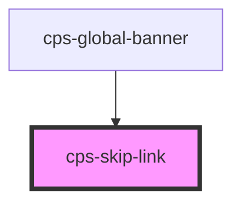

# cps-skip-link

<!-- Auto Generated Below -->

## Properties

| Property       | Attribute        | Description | Type      | Default |
| -------------- | ---------------- | ----------- | --------- | ------- |
| `isOutSystems` | `is-out-systems` |             | `boolean` | `false` |

## Dependencies

### Used by

 - [cps-global-banner](../cps-global-banner)

### Graph

----------------------------------------------

*Built with [StencilJS](https://stenciljs.com/)*
