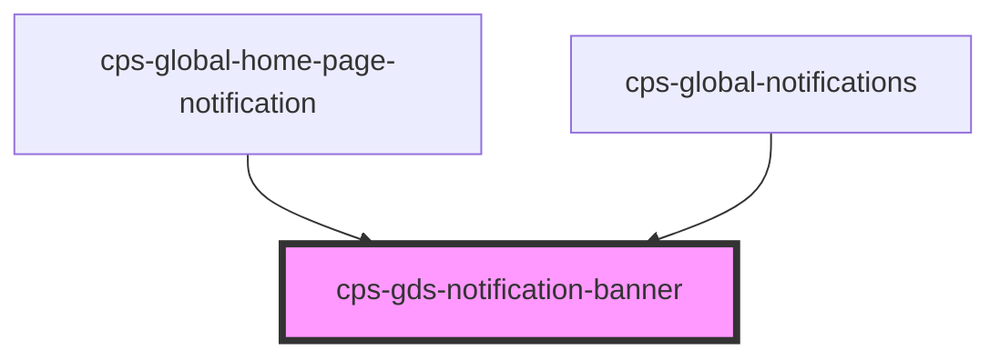

# cps-gds-notification-banner

<!-- Auto Generated Below -->

## Properties

| Property            | Attribute             | Description                                                                                          | Type                     | Default                             |
| ------------------- | --------------------- | ---------------------------------------------------------------------------------------------------- | ------------------------ | ----------------------------------- |
| `disableAutoFocus`  | `disable-auto-focus`  | Prevent the banner from being focused on page load (only relevant for success type).                 | `boolean`                | `false`                             |
| `dismissible`       | `dismissible`         | Renders the dismiss button. Persistence is the caller's responsibility via the `cpsDismissed` event. | `boolean`                | `false`                             |
| `role`              | `role`                | Override the ARIA role. Defaults to "region" (or "alert" for success type).                          | `string \| undefined`    | `undefined`                         |
| `titleHeadingLevel` | `title-heading-level` | The heading level for the title (1-6). Defaults to 2.                                                | `number`                 | `2`                                 |
| `titleId`           | `title-id`            | Custom id for the title element. Defaults to "govuk-notification-banner-title".                      | `string`                 | `"govuk-notification-banner-title"` |
| `titleText`         | `title-text`          | The title text shown in the banner header. Defaults to "Important" or "Success" based on type.       | `string \| undefined`    | `undefined`                         |
| `type`              | `type`                | Set to "success" for the green success variant. Omit for the default (information) variant.          | `"success" \| undefined` | `undefined`                         |

## Events

| Event          | Description                                    | Type                |
| -------------- | ---------------------------------------------- | ------------------- |
| `cpsDismissed` | Fired when the user clicks the dismiss button. | `CustomEvent<void>` |

## Dependencies

### Used by

 - [cps-global-home-page-notification](../cps-global-home-page-notification)
 - [cps-global-notifications](../cps-global-notifications)

### Graph

----------------------------------------------

*Built with [StencilJS](https://stenciljs.com/)*
