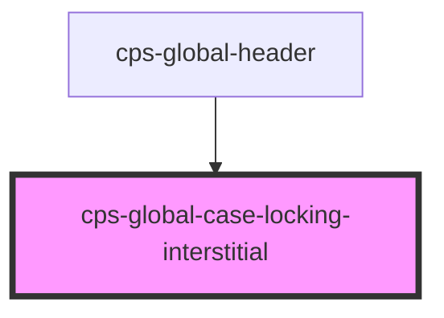

# cps-global-case-locking-interstitial

<!-- Auto Generated Below -->

## Overview

The interruption, from the UCD prototype's moj-interruption-card.

WHY NOT A MODAL <dialog>
showModal() is the tidy answer to "block the page accessibly" — the browser
inerts the whole document, traps focus and supplies a backdrop, all without
touching the host's DOM. But it puts the dialog in the TOP LAYER, which covers
everything, and the design keeps the header and footer visible. So we do it
ourselves: an overlay occupying the band below the header, plus `inert` on the
host's content.

WHAT `inert` BUYS
Covering the page visually is not enough. Without it a screen reader still
reads the case underneath and the keyboard still tabs into it — the user is
told to stop while the page quietly says otherwise. `inert` removes those
elements from the accessibility tree AND the tab order in one attribute.

THE PAGE IS FROZEN WHILE WE ARE UP
An overlay over a page that still scrolls reads as a floating panel, however
it is styled. Locking the document's overflow means nothing behind us can
move, so the band reads as the page rather than as a sheet on top of it — and
with nothing moving there is nothing to re-measure on scroll either.

WE MUTATE HOST DOM HERE, WHICH WE OTHERWISE AVOID. It is confined to setting
and clearing `inert` on the direct children of <body>, excluding our own root,
and every path that hides the overlay releases it — including
disconnectedCallback, because a host app that tears us down mid-interruption
must not be left with an unusable page.

ACCESSIBILITY
role="alertdialog" is the role for an interruption that demands a decision.
Focus moves into the card when it appears, so assistive tech announces it
rather than leaving it to be discovered, and Escape dismisses — both choices
are visible, so trapping the keyboard would cost more than it buys.

## Dependencies

### Used by

 - [cps-global-header](../cps-global-header)

### Graph

----------------------------------------------

*Built with [StencilJS](https://stenciljs.com/)*
