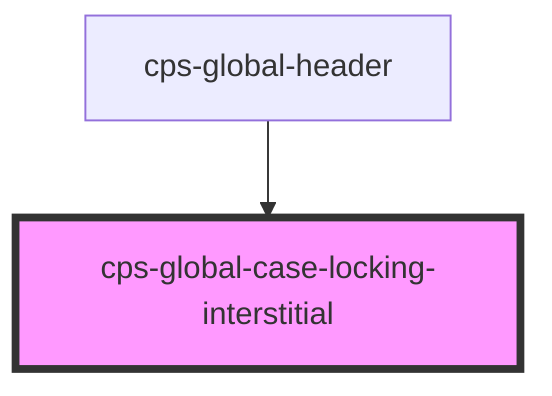

# cps-global-case-locking-interstitial

<!-- Auto Generated Below -->

## Overview

The interruption, from the UCD prototype's moj-interruption-card.

WE REPLACE THE PAGE'S CONTENT RATHER THAN COVER IT.
In the prototype this card is rendered INSIDE <main>: the server simply does
not send the case, so the card is the page's content, in normal flow, with the
header and footer still around it.

Two earlier attempts tried to imitate that from outside, and both failed in
ways worth recording. A modal <dialog> renders in the TOP LAYER, so it covers
the header and footer the design keeps. A fixed overlay band, measured to sit
between our header and our footer, is what actually shipped — and a fixed sheet
over a live page betrays itself however it is styled: it grew its own
scrollbar, and it visibly shifted as the page was dragged underneath it.

So we do what the prototype does. The host's content is HIDDEN and the card
renders in the ordinary document flow, inside cps-global-header where this
component already lives. There is nothing to measure, nothing to keep in sync
with scrolling, no z-index and no second scrollbar — the page is simply
shorter while the interruption is up.

WE MUTATE HOST DOM HERE, WHICH WE OTHERWISE AVOID. It is confined to inline
`display` on the direct children of <body>, with each previous inline value
captured so release restores exactly what was there. Every path that hides the
card releases it, including disconnectedCallback — a host app that tears us
down mid-interruption must not be left with an invisible page.

WHAT IS SPARED: our own subtree, and the subtree containing cps-global-footer.
Both are found by walking up from elements of OURS, never by guessing at the
host's markup — hunting for the host's own header or footer by selector is the
fragility that has cost us twice elsewhere.

ACCESSIBILITY
role="alertdialog" is the role for an interruption that demands a decision, and
focus moves into it so assistive tech announces it rather than leaving it to be
discovered. Hiding the host content with `display: none` takes it out of the
accessibility tree and the tab order in one move, so aria-modal is an honest
claim; our own chrome, which stays visible, is made inert for the same reason.
Escape dismisses, and focus returns to wherever it came from.

## Dependencies

### Used by

 - [cps-global-header](../cps-global-header)

### Graph

----------------------------------------------

*Built with [StencilJS](https://stenciljs.com/)*
