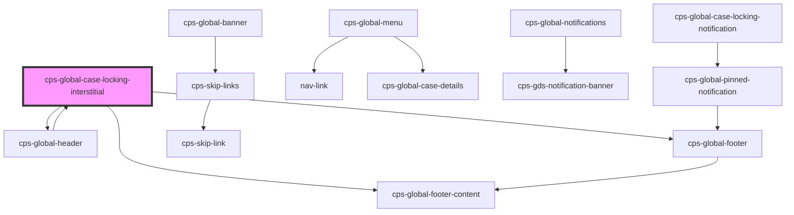

# cps-global-case-locking-interstitial

<!-- Auto Generated Below -->

## Overview

The interruption, rebuilt as a top-layer dialog.

WHY REPLACE THE PAGE RATHER THAN EDIT IT
Three earlier versions tried to imitate an interruption from outside, and each
was wrong in a way that only showed up on a real page: a fixed overlay band
measured between our header and footer grew its own scrollbar and visibly
shifted when the page was dragged; hiding the host's content element by element
worked until the host changed the page underneath us.

That last one is worth spelling out, because it looked correct. It walked the
DOM setting `display: none` on element siblings up the ancestor chain and
remembered each one so it could be put back — a snapshot of a page that does not
hold still. Content the host added afterwards was never hidden, a subtree it
re-rendered came back, and a `display` it set while we were up got clobbered on
restore.

showModal() sidesteps the whole category. The browser puts this in the top
layer, makes the rest of the document inert — out of the accessibility tree and
the tab order — traps focus, handles Escape, and RESTORES FOCUS on close. We
touch no host DOM at all, so there is nothing to remember and nothing to undo.

WHY THE CHROME IS IN HERE
The top layer covers everything, including our own header and footer, and the
design keeps them. So the dialog carries its own: cps-global-header in
chrome-only mode, and cps-global-footer-content. Whole components, not a
reassembly of their parts — the theme classes, custom host CSS, error fallback
and ordering stay owned by the header, and cannot drift from it.

...AND WHY IT IS HIDDEN FROM ASSISTIVE TECH
Visually the chrome is context. To a screen reader it would be a full
navigation menu and a footer sitting between the user and the decision, read
out before the message and joining the tab order of an interruption that is
meant to have two exits. `inert` plus `aria-hidden` makes it what it actually
is: decoration. The only thing exposed in here is the choice.

The card is also FIRST in the DOM, with the chrome placed visually by flex
`order`, so reading order starts at the message.

## Dependencies

### Used by

 - [cps-global-header](../cps-global-header)

### Depends on

- [cps-global-header](../cps-global-header)
- [cps-global-footer-content](../cps-global-footer-content)
- [cps-global-footer](../cps-global-footer)

### Graph

----------------------------------------------

*Built with [StencilJS](https://stenciljs.com/)*
