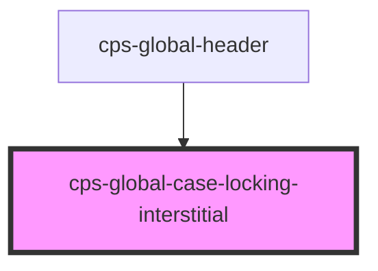

# cps-global-case-locking-interstitial

<!-- Auto Generated Below -->

## Overview

The interruption, from the UCD prototype's moj-interruption-card.

WHY A NATIVE <dialog> RATHER THAN AN OVERLAY DIV
In the prototype this card is rendered INSIDE <main>, replacing the page
content — the server simply does not send the case. We cannot do that: we are
a guest component on a page whose DOM belongs to someone else.

showModal() gets us the same effect without touching a single node of theirs.
The browser puts the dialog in the top layer and makes the entire rest of the
document inert — out of the accessibility tree, unfocusable, unclickable — and
gives us the focus trap, the backdrop and Escape handling for free. The
alternative (a fixed overlay plus `inert` applied to the host's body children)
works, but means mutating and then reliably un-mutating host DOM while their
app re-renders underneath us, which is exactly the class of thing that breaks
quietly.

The cost is that it covers our own header too. UCD's design already answers
that: the card carries both exits, so the user is never stranded.

ACCESSIBILITY
role="alertdialog" is the role for an interruption that demands a decision —
a screen reader announces it rather than leaving it to be discovered. It is
labelled by the heading and described by the body, and focus moves into it on
open (showModal does that, to the first focusable element — here, "Continue").
Escape dismisses, deliberately: both choices are visible, so trapping the
keyboard would buy nothing and cost a lot.

## Dependencies

### Used by

 - [cps-global-header](../cps-global-header)

### Graph

----------------------------------------------

*Built with [StencilJS](https://stenciljs.com/)*
