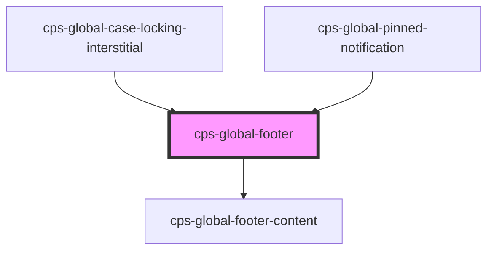

# cps-global-footer

<!-- Auto Generated Below -->

## Properties

| Property    | Attribute    | Description | Type                  | Default     |
| ----------- | ------------ | ----------- | --------------------- | ----------- |
| `userEmail` | `user-email` |             | `string \| undefined` | `undefined` |

## Dependencies

### Used by

 - [cps-global-case-locking-interstitial](../cps-global-case-locking-interstitial)
 - [cps-global-pinned-notification](../cps-global-pinned-notification)

### Depends on

- [cps-global-footer-content](../cps-global-footer-content)

### Graph

----------------------------------------------

*Built with [StencilJS](https://stenciljs.com/)*
