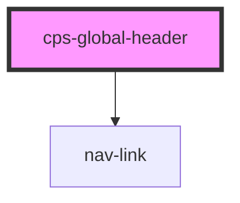

# cps-global-header

<!-- Auto Generated Below -->

## Properties

| Property | Attribute | Description | Type     | Default            |
| -------- | --------- | ----------- | -------- | ------------------ |
| `name`   | `name`    |             | `string` | `"Please wait..."` |

## Dependencies

### Depends on

- [nav-link](internal)

### Graph

----------------------------------------------

*Built with [StencilJS](https://stenciljs.com/)*
