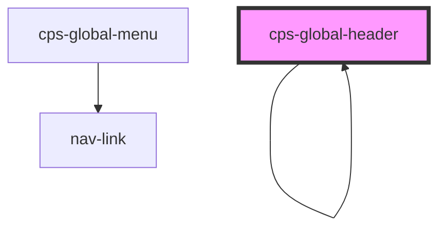

# cps-global-header

<!-- Auto Generated Below -->

## Properties

| Property | Attribute | Description | Type      | Default |
| -------- | --------- | ----------- | --------- | ------- |
| `isDcf`  | `is-dcf`  |             | `boolean` | `false` |

## Dependencies

### Used by

 - [cps-global-header](.)

### Depends on

- [cps-global-banner](../cps-global-banner)
- [cps-global-menu](../cps-global-menu)
- [cps-global-header](.)

### Graph

----------------------------------------------

*Built with [StencilJS](https://stenciljs.com/)*
