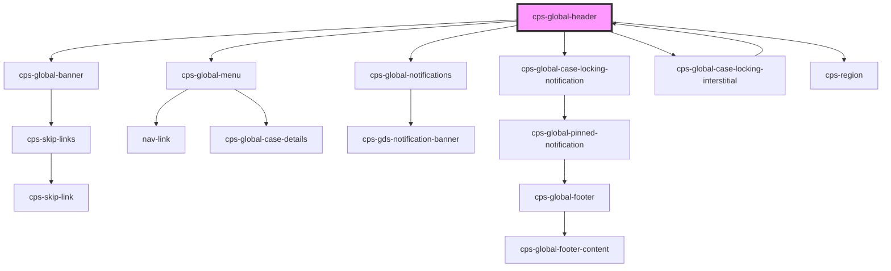

# cps-global-header

<!-- Auto Generated Below -->

## Properties

| Property     | Attribute     | Description                                                                                                                                                                                                                                                                                                                                                                                                                                                                                                                                                                                                                                                                                                                                 | Type      | Default |
| ------------ | ------------- | ------------------------------------------------------------------------------------------------------------------------------------------------------------------------------------------------------------------------------------------------------------------------------------------------------------------------------------------------------------------------------------------------------------------------------------------------------------------------------------------------------------------------------------------------------------------------------------------------------------------------------------------------------------------------------------------------------------------------------------------- | --------- | ------- |
| `chromeOnly` | `chrome-only` | Render the CHROME ONLY — the banner and the menu — and none of the components that do things.  This exists for one caller: cps-global-case-locking-interstitial renders a header inside its dialog so the interruption looks like a page rather than a card on a blank screen. Reusing this component rather than reassembling its parts keeps the theme classes, the custom host CSS, the error fallback and the ordering in ONE place — hand-copying them would drift the moment any of them changed. Without this flag it would also recurse, since the block below renders the overlay itself.  The gate wraps the behavioural children as a GROUP rather than listing exclusions, so anything added there later is covered by default. | `boolean` | `false` |
| `isDcf`      | `is-dcf`      |                                                                                                                                                                                                                                                                                                                                                                                                                                                                                                                                                                                                                                                                                                                                             | `boolean` | `false` |

## Dependencies

### Used by

 - [cps-global-case-locking-interstitial](../cps-global-case-locking-interstitial)

### Depends on

- [cps-global-banner](../cps-global-banner)
- [cps-global-menu](../cps-global-menu)
- [cps-global-notifications](../cps-global-notifications)
- [cps-global-case-locking-notification](../cps-global-case-locking-notification)
- [cps-global-case-locking-interstitial](../cps-global-case-locking-interstitial)
- [cps-region](../cps-global-locking-region)

### Graph

```mermaid
graph TD;
  cps-global-header --> cps-global-banner
  cps-global-header --> cps-global-menu
  cps-global-header --> cps-global-notifications
  cps-global-header --> cps-global-case-locking-notification
  cps-global-header --> cps-global-case-locking-interstitial
  cps-global-header --> cps-region
  cps-global-banner --> cps-skip-links
  cps-skip-links --> cps-skip-link
  cps-global-menu --> nav-link
  cps-global-menu --> cps-global-case-details
  cps-global-notifications --> cps-gds-notification-banner
  cps-global-case-locking-notification --> cps-global-pinned-notification
  cps-global-pinned-notification --> cps-global-footer
  cps-global-footer --> cps-global-footer-content
  cps-global-case-locking-interstitial --> cps-global-header
  style cps-global-header fill:#f9f,stroke:#333,stroke-width:4px
```

----------------------------------------------

*Built with [StencilJS](https://stenciljs.com/)*
