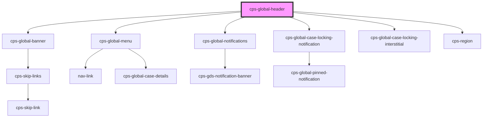

# cps-global-header

<!-- Auto Generated Below -->

## Properties

| Property | Attribute | Description | Type      | Default |
| -------- | --------- | ----------- | --------- | ------- |
| `isDcf`  | `is-dcf`  |             | `boolean` | `false` |

## Dependencies

### Depends on

- [cps-global-banner](../cps-global-banner)
- [cps-global-menu](../cps-global-menu)
- [cps-global-notifications](../cps-global-notifications)
- [cps-global-case-locking-notification](../cps-global-case-locking-notification)
- [cps-global-case-locking-interstitial](../cps-global-case-locking-interstitial)
- [cps-region](../cps-global-locking-region)

### Graph

```mermaid
graph TD;
  cps-global-header --> cps-global-banner
  cps-global-header --> cps-global-menu
  cps-global-header --> cps-global-notifications
  cps-global-header --> cps-global-case-locking-notification
  cps-global-header --> cps-global-case-locking-interstitial
  cps-global-header --> cps-region
  cps-global-banner --> cps-skip-links
  cps-skip-links --> cps-skip-link
  cps-global-menu --> nav-link
  cps-global-menu --> cps-global-case-details
  cps-global-notifications --> cps-gds-notification-banner
  cps-global-case-locking-notification --> cps-global-pinned-notification
  style cps-global-header fill:#f9f,stroke:#333,stroke-width:4px
```

----------------------------------------------

*Built with [StencilJS](https://stenciljs.com/)*
