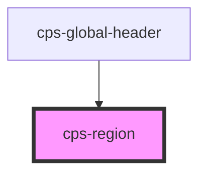

# cps-region

**For host application teams.** Tells the case-locking system which part of a case
the user is currently looking at, so other users can be told that someone is there.

## What to do

Put the tag inside — or wrapped around — the markup that represents the active
section:

```html
<cps-region code="case_review"></cps-region>
```

That is the whole integration. No JavaScript, no configuration, no call to make
when the user leaves. The tag is the statement.

## When it counts

The user is registered as present while the tag is **in the DOM and visible** —
visible meaning neither it nor any ancestor is `display: none`.

So you do not have to remove it when a panel closes. If you hide the section the
way you already hide it, presence follows. Re-showing it registers again. Moving
the element in the DOM does not produce a spurious leave-and-rejoin.

## `code`

The section the user is in. Lower-case by convention here; it is upper-cased on the
wire, so `case_review` becomes `CASE_REVIEW`.

The codes in use today:

| `code` | Means |
| --- | --- |
| `case` | The case as a whole. **Ours** — the global header adds this on every case page as a fallback. You do not need to add it. |
| `case_review` | The case review screen |
| `victim_witness` | A victim or witness — needs a `subject` |
| `defendant` | A defendant — needs a `subject` |

**It must match what the other clients use for the same thing.** CMS Classic and
CMS Modern register these same section names; a code that differs by a character is
a different section, and the two systems will not see each other.

## `subject`

For sections that are about one person rather than the whole case:

```html
<cps-region code="victim_witness" subject="98765"></cps-region>
```

The id must be the same one the other clients use for that person, or you will
register a section nobody else is in.

Without a `subject` the section is case-wide (`<caseId>:CASE_REVIEW`); with one it
is scoped to that subject (`<caseId>:VICTIM_WITNESS:98765`).

## What happens to the case-wide fallback

Our global header registers `case` on every case page, because something has to
claim presence before any host app says anything more specific.

**As soon as your region appears, ours stands down**, and yours is what is
reported. When your region goes, ours comes back. You do not need to coordinate
with it, and adding your region will not make one user look like two.

## Two things to avoid

**One region per section, not per row.** Two regions with the same `code` and
`subject` are one section. Two with different `subject`s are two — which is right
for two witness panels open at once, and wrong if you have simply repeated the tag.

**Do not add `code="case"`.** The header already does, and yours would be
indistinguishable from the fallback.

<!-- Auto Generated Below -->


## Properties

| Property            | Attribute | Description                                                                                                                                                                                                                                                                                                | Type                  | Default     |
| ------------------- | --------- | ---------------------------------------------------------------------------------------------------------------------------------------------------------------------------------------------------------------------------------------------------------------------------------------------------------- | --------------------- | ----------- |
| `code` _(required)_ | `code`    | Identifier passed to the central service when this region enters or leaves "present" state. Reflected so it's readable as an attribute.                                                                                                                                                                    | `string`              | `undefined` |
| `subject`           | `subject` | Optional subject for kinds that are scoped to one — a witness, a defendant. With it the section is "<caseId>:KIND:<subjectId>"; without it the section is case-wide, "<caseId>:KIND". Must match the id the other clients use for the same person, or the two register different sections for one subject. | `string \| undefined` | `undefined` |


## Dependencies

### Used by

 - [cps-global-header](../cps-global-header)

### Graph


----------------------------------------------

*Built with [StencilJS](https://stenciljs.com/)*
