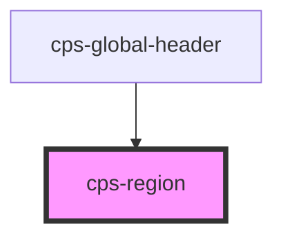

# cps-region

<!-- Auto Generated Below -->

## Properties

| Property            | Attribute | Description                                                                                                                                                                                                                                                                                                | Type                  | Default     |
| ------------------- | --------- | ---------------------------------------------------------------------------------------------------------------------------------------------------------------------------------------------------------------------------------------------------------------------------------------------------------- | --------------------- | ----------- |
| `code` _(required)_ | `code`    | Identifier passed to the central service when this region enters or leaves "present" state. Reflected so it's readable as an attribute.                                                                                                                                                                    | `string`              | `undefined` |
| `subject`           | `subject` | Optional subject for kinds that are scoped to one — a witness, a defendant. With it the section is "<caseId>:KIND:<subjectId>"; without it the section is case-wide, "<caseId>:KIND". Must match the id the other clients use for the same person, or the two register different sections for one subject. | `string \| undefined` | `undefined` |

## Dependencies

### Used by

 - [cps-global-header](../cps-global-header)

### Graph

----------------------------------------------

*Built with [StencilJS](https://stenciljs.com/)*
