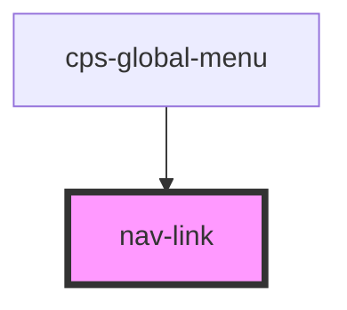

# cps-global-header

<!-- Auto Generated Below -->

## Properties

| Property                | Attribute                 | Description | Type                                            | Default     |
| ----------------------- | ------------------------- | ----------- | ----------------------------------------------- | ----------- |
| `ariaSelected`          | `aria-selected`           |             | `boolean \| undefined`                          | `undefined` |
| `disabled`              | `disabled`                |             | `boolean`                                       | `undefined` |
| `href`                  | `href`                    |             | `string`                                        | `undefined` |
| `label`                 | `label`                   |             | `string`                                        | `undefined` |
| `openInNewTab`          | `open-in-new-tab`         |             | `boolean \| undefined`                          | `undefined` |
| `preferEventNavigation` | `prefer-event-navigation` |             | `"private" \| "public" \| boolean \| undefined` | `undefined` |
| `selected`              | `selected`                |             | `boolean`                                       | `undefined` |

## Events

| Event                             | Description | Type                  |
| --------------------------------- | ----------- | --------------------- |
| `cps-global-header-event`         |             | `CustomEvent<string>` |
| `cps-global-header-event-private` |             | `CustomEvent<string>` |

## Dependencies

### Used by

 - [cps-global-menu](.)

### Graph

----------------------------------------------

*Built with [StencilJS](https://stenciljs.com/)*
