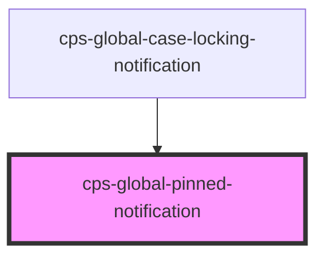

# cps-global-pinned-notification

<!-- Auto Generated Below -->

## Overview

The pinned notification from the UCD prototype's app-notification-banner-pinned.

WHY THIS IS NOT A FLAG ON cps-gds-notification-banner
It began as one, and the specialisation outgrew it. This component positions
itself against the viewport, mutates the host page's layout, owns a
progressive-enhancement toggle and answers to UCD; the GDS banner is a thin
shell over a govuk-frontend component and answers to govuk-frontend. Sharing
one component meant every notification in the app rendered through code that
only the pinned one used — including host-DOM teardown it never performed.

The prototype makes the same split: app-notification-banner-pinned is a
wrapper with its own JS module around a stock govuk-notification-banner.

WHY NOT COMPOSE the GDS banner inside this one, which would avoid repeating
its markup: the toggle has to sit INSIDE the banner's header, next to the
title. The prototype achieves that by reaching in with jQuery
(header.append(toggle)). Doing the equivalent across a component boundary is
worse than repeating twenty lines of markup that govuk-frontend has not
changed in years.

## Properties

| Property            | Attribute             | Description                                                                                                                                                                                                                                                                                                                                                             | Type                  | Default     |
| ------------------- | --------------------- | ----------------------------------------------------------------------------------------------------------------------------------------------------------------------------------------------------------------------------------------------------------------------------------------------------------------------------------------------------------------------- | --------------------- | ----------- |
| `collapsible`       | `collapsible`         | Show only the header until the user asks for detail — the prototype's progressive enhancement, reimplemented rather than bolted on with jQuery. The toggle carries aria-expanded and aria-controls, and the content is genuinely `hidden` when collapsed, so assistive tech is told the same story the sighted user gets rather than reading content that looks closed. | `boolean`             | `false`     |
| `dismissible`       | `dismissible`         | Renders the dismiss button. Persistence is the caller's responsibility via the `cpsDismissed` event.                                                                                                                                                                                                                                                                    | `boolean`             | `false`     |
| `titleHeadingLevel` | `title-heading-level` | The heading level for the title (1-6). Defaults to 2.                                                                                                                                                                                                                                                                                                                   | `number`              | `2`         |
| `titleText`         | `title-text`          | The title text shown in the banner header.                                                                                                                                                                                                                                                                                                                              | `string \| undefined` | `undefined` |

## Events

| Event          | Description                                    | Type                |
| -------------- | ---------------------------------------------- | ------------------- |
| `cpsDismissed` | Fired when the user clicks the dismiss button. | `CustomEvent<void>` |

## Dependencies

### Used by

 - [cps-global-case-locking-notification](../cps-global-case-locking-notification)

### Graph

----------------------------------------------

*Built with [StencilJS](https://stenciljs.com/)*
